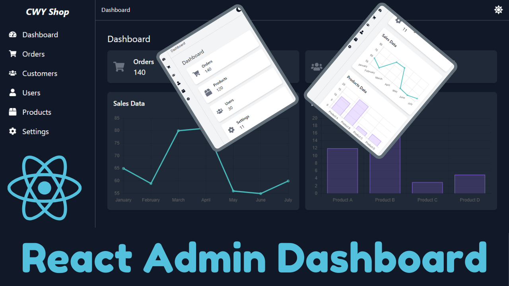

# ⚙️ React Admin Dashboard

A modern, responsive Admin Dashboard built with **React**, **Tailwind CSS**, and **Vite**. Designed with clean UI principles and built for scalability. Includes light/dark mode, sidebar navigation, and reusable components.

🔗 **Live Demo:** [https://admin-dashboard-yourname.vercel.app](https://admin-dashboard-Kudostech.vercel.app)

---

## 📸 Screenshots



---

## 🚀 Features

- ✅ Fully responsive layout
- 🌙 Light and Dark mode toggle
- 🧭 Sidebar navigation with active states
- 🧩 Reusable components (Sidebar, Header, Main Content)
- ⚡ Fast loading with Vite
- 🎨 Styled with Tailwind CSS

---

## 🛠️ Tech Stack

- **React.js**
- **Tailwind CSS**
- **Vite**
- **Vercel** for deployment

---

## 📁 Folder Structure

```bash
src/
├── assets/
├── components/
│   ├── Sidebar.jsx
│   ├── Header.jsx
├── pages/
│   └── Dashboard.jsx
├── App.jsx
├── main.jsx
